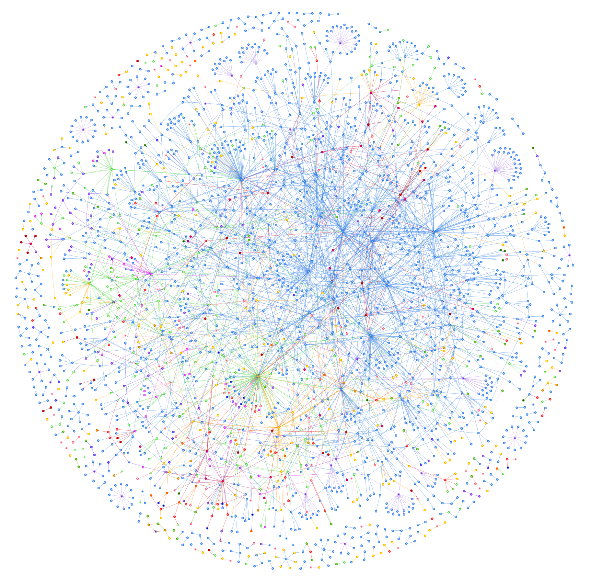

# Knowledge Graph Generator v2.0

An enhanced Streamlit application that extracts graph data (entities and relationships) from text input using LangChain and OpenAI's GPT-4o model, and generates interactive graphs with intelligent chunking and real-time progress tracking.

## Example Graph Visualization



*Example graph generated from Wardley Mapping documentation showing entities and relationships with interactive visualization.*

## 🆕 What's New in v2.0

- **Smart Text Chunking**: Intelligent semantic splitting using markdown headers with 100k token limit per chunk
- **Real-time Progress Tracking**: Visual progress bar with time estimates and chunk-by-chunk status updates
- **Multiple File Format Support**: Upload both `.txt` and `.md` files for optimal chunking results
- **Multi-format Graph Export**: Save graphs as HTML, JSON, GraphML, and GML formats
- **Enhanced Error Handling**: Comprehensive error management with proper cleanup
- **Improved Performance**: Optimized processing for large documents (tested with 229-chunk files)

## Features

### Input Methods
- **File Upload**: Support for both `.txt` and `.md` files with automatic format detection
- **Direct Text Input**: Paste or type text directly into the interface
- **Large Document Handling**: Automatic chunking for documents exceeding token limits

### Processing & Visualization
- **Intelligent Chunking**: Semantic markdown header-based splitting (# ## ### ####) with character-based fallback
- **Real-time Progress**: Visual progress bar with time estimates and status messages
- **Interactive Visualization**: Physics-based graph layout with dark theme and filter controls
- **Entity Relationship Extraction**: Powered by OpenAI's GPT-4o model via LangChain

### Export Options
- **HTML**: Interactive web visualization with PyVis
- **JSON**: Standard format for web applications and analysis tools
- **GraphML**: XML-based format compatible with Gephi, yEd, Cytoscape
- **GML**: Graph Modeling Language for NetworkX, igraph, and analysis libraries

### JavaScript Graph Explorer
- **Standalone Web App**: Modern JavaScript application for interactive graph exploration
- **File Loading**: Support for JSON, GraphML, GML files with drag & drop interface
- **Advanced Filtering**: Multi-select filters for nodes and relationships with real-time search
- **Export Capabilities**: PNG, CSV, and all standard graph formats
- **No Server Required**: Completely client-side application that works offline

## Installation

### Prerequisites

- Python 3.8 or higher
- OpenAI API key
- 4GB+ RAM recommended for large documents

### Dependencies

```bash
pip install -r requirements.txt
```

**Core Dependencies:**
- `langchain` (>= 0.1.0): Core LLM framework
- `langchain-experimental` (>= 0.0.45): Graph transformer features
- `langchain-openai` (>= 0.1.0): OpenAI GPT-4o integration
- `python-dotenv` (>= 1.0.0): Environment variable support
- `pyvis` (>= 0.3.2): Interactive graph visualization
- `streamlit` (>= 1.32.0): Web UI framework
- `networkx`: Graph data structure and algorithms
- `tiktoken`: Token counting and text processing

### Setup

1. **Clone this repository:**
   ```bash
   git clone https://github.com/tractorjuice/knowledge-graph-llms.git
   cd knowledge-graph-llms
   ```

2. **Create environment file:**
   ```bash
   echo "OPENAI_API_KEY=your_openai_api_key_here" > .env
   ```

3. **Install dependencies:**
   ```bash
   pip install -r requirements.txt
   ```

## Running the Application

### Streamlit Web App
```bash
streamlit run streamlit_app.py
```

### JavaScript Graph Explorer
```bash
# Option 1: Direct file access
open js-app/index.html

# Option 2: Local server (recommended)
cd js-app
python -m http.server 8080
# Then visit http://localhost:8080
```

### Jupyter Notebook (Development)
```bash
jupyter notebook knowledge_graph.ipynb
```

The Streamlit application will open at http://localhost:8501.

## Usage Guide

### Basic Workflow

#### **Step 1: Generate Knowledge Graph (Streamlit)**
1. **Choose Input Method**: Select "Upload file" or "Input text" from the sidebar
2. **Provide Content**:
   - **Upload**: Select a `.txt` or `.md` file (markdown files get better semantic chunking)
   - **Direct Input**: Paste or type text directly
3. **Generate Graph**: Click "Generate Knowledge Graph"
4. **Monitor Progress**: Watch real-time progress with time estimates
5. **Review Results**: View the generated graph in the Streamlit interface

#### **Step 2: Advanced Exploration (JavaScript App)**
1. **Open Graph Explorer**: Navigate to `js-app/index.html` or start local server
2. **Load Generated Data**: Click "📁 Load Graph" → Use quick load buttons for generated files
3. **Advanced Analysis**: 
   - Apply sophisticated filters for nodes and relationships
   - Use real-time search with highlighting
   - Explore connections with dynamic node highlighting
4. **Export Results**: Generate PNG images, CSV data, or other formats as needed

#### **Integrated Workflow Benefits**
- **Streamlit**: Optimized for text processing and graph generation
- **JavaScript App**: Optimized for interactive exploration and advanced analysis
- **Seamless Integration**: Files generated by Streamlit work directly in JavaScript app

### Progress Tracking
- **Visual Progress Bar**: Shows completion percentage
- **Status Messages**: Real-time updates like "Processing chunk 3/15..."
- **Time Estimates**: Dynamic estimates improve as processing continues
- **Chunk Details**: Individual chunk completion times displayed

### Graph Interaction
- **Navigation**: Drag nodes, zoom with mouse wheel
- **Information**: Hover over nodes and edges for details
- **Filtering**: Use built-in filter menu for nodes and relationships
- **Physics**: ForceAtlas2 layout with optimized spring constants

### File Formats
- **Markdown (.md)**: Optimal for semantic chunking with headers
- **Text (.txt)**: Supported with character-based fallback chunking
- **Large Files**: Automatically chunked (tested up to 175k tokens/229 chunks)

## Technical Architecture

### Text Processing Pipeline
```
Input Text → Token Analysis → Semantic Chunking → Entity Extraction → Graph Generation → Multi-format Export
```

1. **Chunking Strategy**:
   - Primary: Markdown header splitting (# ## ### ####)
   - Fallback: Recursive character splitting with 200-char overlap
   - Limit: 100k tokens per chunk (respects GPT-4 context window)

2. **Entity Extraction**:
   - LangChain's `LLMGraphTransformer` with GPT-4o
   - Parallel processing of chunks with progress tracking
   - Automatic relationship detection and validation

3. **Visualization**:
   - PyVis network with ForceAtlas2 physics
   - Dark theme with customizable spring constants
   - Filter menu for interactive exploration

### Output Formats

| Format | Use Case | Compatible Tools |
|--------|----------|------------------|
| **HTML** | Interactive web visualization | Any web browser |
| **JSON** | Web apps, custom analysis | D3.js, Cytoscape.js, custom tools |
| **GraphML** | Advanced network analysis | Gephi, yEd, Cytoscape |
| **GML** | Graph libraries and research | NetworkX, igraph, R packages |

## Performance

- **Processing Speed**: ~10-15 seconds per chunk (depends on content complexity)
- **Memory Usage**: Scales with document size (4GB RAM recommended for large files)
- **Token Limits**: Handles documents up to millions of tokens via intelligent chunking
- **Tested Scale**: Successfully processed 175k token documents (229 chunks)

## Source Attribution

This project is an enhanced version based on the original knowledge graph tutorial:

**Original Source**: [Knowledge Graph Tutorial](https://www.youtube.com/watch?v=O-T_6KOXML4)
**Enhanced by**: Claude Code (Anthropic's AI Assistant)
**Enhancements Include**:
- Intelligent text chunking with semantic splitting
- Real-time progress tracking with time estimates
- Multiple file format support (.txt, .md)
- Multi-format graph export (JSON, GraphML, GML)
- Improved error handling and user experience
- Performance optimizations for large documents

## Contributing

1. Fork the repository
2. Create a feature branch (`git checkout -b feature/amazing-feature`)
3. Commit your changes (`git commit -m 'Add amazing feature'`)
4. Push to the branch (`git push origin feature/amazing-feature`)
5. Open a Pull Request

## License

This project is licensed under the MIT License - see the [LICENSE](LICENSE) file for details.

## Acknowledgments

- **LangChain Team**: For the experimental graph transformer capabilities
- **OpenAI**: For the GPT-4o model powering entity extraction
- **PyVis/vis.js**: For the interactive graph visualization framework
- **Original Tutorial**: Foundation knowledge graph implementation
- **Community**: Feedback and suggestions for improvements

---

**Version**: 2.0
**Last Updated**: January 2025
**Compatibility**: Python 3.8+, OpenAI API v1+